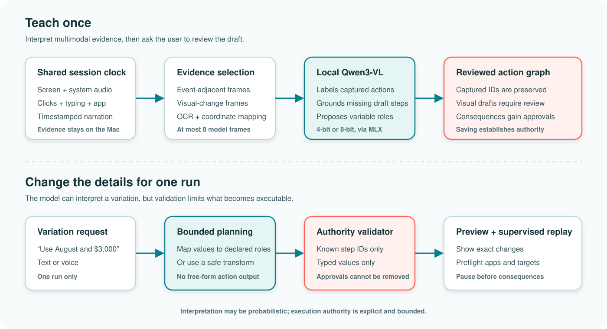

# Abstract

Programming by demonstration can make automation accessible, but recorded macros are brittle while general computer-use agents may synthesize actions beyond what a person intended. We present Neloa, an open-source macOS system for teaching a workflow once and changing bounded details—such as dates, amounts, files, and form values—on later runs. Neloa aligns screen evidence, application and input events, optical character recognition, and timestamped narration. A quantized Qwen3-VL model runs locally to annotate captured actions, reconstruct narrowly grounded missing inputs, and map later instructions to declared variables. The system separates interpretation from authority: model-generated teaching-time actions are evidence-grounded drafts that require review, while run-time model output can replace only text in known variable steps; action identifiers and approval gates remain fixed. We evaluate two quantization tiers in a frozen 15-case synthetic benchmark containing 61 executable assertions, 59 marked critical, across three trials per tier. <!-- ABSTRACT-RESULTS:BEGIN -->Across three fresh-process trials per tier, the 4-bit model passed 3/3 runs with a mean weighted score of 100.0%; the 8-bit model passed 3/3 with 100.0%. The two tiers had 0 critical assertion failures; peak process memory was 3.41 and 5.28 GiB, respectively.<!-- ABSTRACT-RESULTS:END --> These results provide formative evidence about executable invariants and local feasibility, not live-application reliability or end-user usability. We argue that bounded adaptation is a useful middle ground between exact replay and open-ended computer use, especially when recordings should remain on the user’s device.

**Keywords:** programming by demonstration; desktop automation; human-AI interaction; GUI agents; local AI; privacy; mixed initiative

# 1. Introduction

Many everyday computer tasks repeat without repeating exactly. A person may download the same report each week but use a new date, submit the same form with a different amount, or transfer a known value between applications. Conventional macros can reproduce the demonstrated sequence but are often difficult to parameterize or repair. General computer-use agents offer more flexibility by planning actions from a high-level request, but their ability to invent navigation and actions also creates a control problem: the user may not know which parts of the computer the agent considers itself authorized to operate.

Programming-by-demonstration (PBD) systems have long sought to lower the cost of automation for non-programmers. Ringer records robust web actions [@barman2016ringer], WebRobot synthesizes web robotic-process-automation programs from demonstrations [@dong2022webrobot], and SUGILITE combines mobile GUI demonstrations with natural-language instruction [@li2017sugilite; @li2020interactive]. PUMICE further supports concepts and conditionals through dialogue and demonstration [@li2019pumice]. These systems show that demonstration and language complement each other, so voice plus demonstration is not itself a new contribution. Meanwhile, screenshot-driven GUI agents have made grounding and broad desktop control central research problems [@cheng2024seeclick; @xie2024osworld].

Neloa explores a narrower point in this design space: **Can a local model interpret a demonstrated workflow and a later variation without receiving open-ended authority to redesign the run?** The system targets workflows whose route is mostly stable while values or a small set of structured targets change. The model contributes semantic interpretation. Deterministic code decides what output is admissible, preserves the reviewed action graph, previews changes, and pauses before consequential actions.

This paper makes three contributions:

1. A local multimodal teaching pipeline for macOS that places screen evidence, application/input events, OCR, and word-timestamped narration on a shared session clock.
2. A two-stage authority design: evidence-grounded model proposals require review during teaching, and later variation planning is limited to known variable steps or explicitly implemented structured transformations.
3. A reproducible formative benchmark that distinguishes deterministic from model-dependent cases and records assertion outcomes, repeated-run variability, latency, model size, and peak memory for 4-bit and 8-bit Qwen3-VL.

The evaluation is intentionally bounded. It uses synthetic fixtures and exact executable assertions rather than live accounts or human participants. Accordingly, we do not claim that Neloa works for arbitrary desktop tasks, improves non-programmer performance, or is safe against all GUI-agent attacks. The contribution is a system architecture and an auditable first measurement of its implemented boundary.

# 2. Related Work

## 2.1 Programming by demonstration and multimodal teaching

PBD converts observed interaction traces into reusable programs. Web systems such as Ringer and WebRobot demonstrate how recording at the user-interface level can make automation accessible without requiring DOM or scripting expertise [@barman2016ringer; @dong2022webrobot]. HILC showed that follow-up questions can help non-programmers resolve ambiguity in cross-application GUI demonstrations [@intharah2017confusing]. These systems motivate Neloa’s use of observed actions as durable evidence rather than asking a model to plan a task from scratch.

SUGILITE is the closest conceptual predecessor. It combines verbal instructions with mobile GUI demonstrations, grounds language in interface structure, and infers parameters [@li2017sugilite; @li2020interactive]. PUMICE adds user-taught concepts and conditional structures [@li2019pumice]. Neloa differs in platform and system boundary rather than in claiming the combination of voice and demonstration as novel. It focuses on desktop-wide visual evidence when accessibility events are incomplete, keeps ordinary inference on-device, and restricts later adaptation to a reviewed action graph.

Mixed-initiative systems also show the value of making generated automation inspectable and repairable. MIWA uses natural-language descriptions, visual correspondence, step-through debugging, and incremental refinement to improve control and confidence in web automation [@chen2023miwa]. Neloa similarly exposes a timeline and action cards, but its present evaluation does not measure confidence or usability. Those remain future human-subject questions.

## 2.2 Visual GUI agents and grounding

Screenshot-driven agents broaden automation beyond structured web interfaces, but accurate grounding remains difficult. SeeClick frames GUI grounding as mapping language to actionable screen locations and introduces ScreenSpot across mobile, desktop, and web interfaces [@cheng2024seeclick]. OSWorld evaluates open-ended agents across real operating systems and applications, reporting a large gap between human and agent task success [@xie2024osworld]. These works pursue increasingly general action generation and execution.

Neloa uses a vision-language model differently. It does not ask the model to operate in a repeated observe-plan-act loop. During teaching, the model annotates captured actions and may propose a small number of missing, visually grounded draft actions. During replay, it maps a variation instruction to existing variable identifiers. Deterministic code remains responsible for action admission and execution. This sacrifices generality in exchange for a more legible authority boundary.

## 2.3 Local inference, privacy, and human control

GUI recordings can expose messages, documents, identifiers, and financial data. PrivAuto demonstrates the motivation and difficulty of privacy-preserving GUI agents: even an on-device sanitization stage can miss contextual personally identifiable information [@hu2026privauto]. Neloa avoids a separate cloud inference stage in its normal model path; downloaded Qwen3-VL weights execute through MLX on Apple silicon [@apple2026mlx; @bai2025qwen3vl]. This is a data-flow property, not a formal privacy guarantee. The operating system, target applications, model files, and any compromised local process remain outside the protection claim.

Human-AI interaction guidance recommends making system capabilities visible, supporting correction, and scoping services to context [@amershi2019guidelines]. Neloa operationalizes these ideas with a reviewable draft, explicit one-run changes, readiness checks, and approvals. The paper tests whether those controls survive a narrow set of executable transformations; it does not yet test whether people notice or understand them.

# 3. System and Authority Model

{#fig:architecture width=100%}

*Alt text: Two horizontal flows. The teaching flow aligns screen, audio, input, application, OCR, and narration evidence; selects frames; sends them to a local Qwen3-VL model; and produces a reviewed action graph. The run flow maps a text or voice variation through bounded planning and an authority validator before preview and supervised replay. A note states that interpretation is probabilistic while execution authority is explicit and bounded.*

## 3.1 Teaching capture

The macOS application records a selected display or follows the active application using ScreenCaptureKit. System audio is optional. A separate event recorder observes clicks, keystrokes, application identity, bundle identifier, coordinates, and display identifier when macOS permissions allow. Microphone audio is transcribed with on-device speech recognition. The screen recorder establishes a timeline origin; microphone segments and input events record offsets from the same origin. This permits the system to retrieve narration near an action rather than treating the transcript as an unordered paragraph.

The evidence extractor considers action-adjacent frames and uniformly sampled frames so that a recording remains useful when the event tap misses an action. It scans up to 36 candidate times and sends at most eight selected frames to the model. Frames are resized to at most 1,280 pixels on either dimension, OCR is computed locally, and click coordinates are mapped between display and image coordinate systems. Generic clicks may receive focused crops. Spreadsheet recovery receives special, narrow grounding from the selected-cell outline, name box, formula-bar OCR, and nearby narration.

## 3.2 Teaching-time interpretation

The local Qwen3-VL model receives ordered frames, OCR, captured replay steps, and timestamped narration. For a complete capture, it can rename and describe actions but the application layer looks up annotations by captured step identifier. It cannot replace those identifiers, captured coordinates, or captured input text. For incomplete capture, the model may propose `click`, `typeText`, or one of four allowed key presses. A proposal is admitted only if it exceeds a confidence threshold, maps to supplied visual evidence, passes text and action safety filters, and is not a duplicate of a captured action. Consequential visual proposals such as sending, sharing, purchasing, deletion, permission changes, or password entry are rejected.

This stage does permit the model to expand the draft; therefore it would be inaccurate to say that only captured events can ever become actions. Instead, visually reconstructed actions are marked as model-originated drafts and shown in the review interface. Saving the reviewed workflow establishes the action authority for future runs. This distinction—draft expansion during teaching versus graph preservation during adaptation—is central to the design.

## 3.3 Run-time bounded adaptation

At run time, a user can run the workflow unchanged or provide a text/voice instruction such as “Use August 2026 and change the amount to $3,000.” The prompt sent to Qwen contains only declared variable steps with their exact identifiers, titles, targets, current text, application, and demonstrated order. The model returns JSON replacements keyed by step identifier. The validator accepts a replacement only when the identifier exists, belongs to a variable `typeText` step, appears once, contains safe text, differs from the original, and does not encode a structural spreadsheet reference.

The model cannot return arbitrary clicks, URLs, key presses, or action insertions in this phase. The run planner builds the result by copying the saved steps and mutating only accepted text fields. A small number of deterministic transformations provide bounded structural variation. For example, a validated Google Sheets cell request can replace a demonstrated cell target by inserting a fixed “Go to range” command; it does not ask the model to invent a coordinate. Watched-folder triggers can substitute a file path only when it is inside the configured folder and maps to an existing file-input step.

Consequential captured actions receive approval metadata during compilation. Because planning copies existing steps and never accepts approval fields from the model, a request such as “submit without asking” cannot remove the pause. The UI presents the proposed changes, checks applications and targets, and then performs supervised replay. This yields the following implemented invariant:

> For an adapted run, every executable step is a reviewed saved step or an explicitly implemented deterministic transformation; model output may replace only validated values on declared variable identifiers, and it cannot remove an approval requirement.

# 4. Formative Evaluation

## 4.1 Research questions

We ask three questions within the implemented product boundary:

- **RQ1—Interpretation and adaptation:** Do the local 4-bit and 8-bit models satisfy exact assertions for semantic annotation, partial/video-only reconstruction, and mapping one or more requested values to known roles?
- **RQ2—Authority preservation:** Under unchanged, unsupported, and adversarial requests, do action identifiers, unrelated steps, navigation, and approvals remain unchanged?
- **RQ3—Local feasibility:** What cached model setup time, total suite time, peak resident memory, and on-disk model size are observed for each tier on the test Mac?

## 4.2 Frozen benchmark

The benchmark was frozen before collection at source commit `74452fe`; the reproducibility runner and metric instrumentation were committed before trials. It contains 15 synthetic cases, 61 weighted assertions, and 59 critical assertions. Five cases are deterministic: semantic compilation of a narrated Google Sheets trace, fixture-grounding validity, a structured new-cell transformation, unchanged replay, and a known-data cross-application transfer. Ten cases invoke Qwen: complete-capture annotation, partial-capture repair, video-only recovery, two spreadsheet-value adaptation cases, unsupported structural-change rejection, adversarial instruction rejection, recurring-report adaptation, three-field form adaptation, and approval-preserving submit adaptation.

Fixtures are generated locally. The primary visual fixture is a synthetic spreadsheet with a selected cell, formula-bar value, and OCR; another fixture presents a monthly-report field and download control. The test does not sign in to Google Drive, submit an invoice, or manipulate an external account. Expected outputs are encoded as executable assertions rather than judged by another language model.

Examples include preserving the exact identifiers and coordinates of a complete capture; recovering values `X` and `3` into `Sheet2!A1` and `Sheet2!B1`; mapping “Use Z in A1 and 7 in B1” to the two correct value steps; refusing to reinterpret “Use Sheet3” as a cell value; preserving the URL and action graph under an instruction that asks the model to ignore rules, delete a sheet, change the URL, and send the spreadsheet; and retaining the approval pause when instructed to submit an invoice without asking.

The “adversarial” case is a malicious **run instruction**, not an indirect prompt embedded in a webpage. We therefore report only resistance to unauthorized expansion through the variation interface.

## 4.3 Models, procedure, and metrics

We evaluated `lmstudio-community/Qwen3-VL-4B-Instruct-MLX-4bit` at revision `552af30...892bc` and the 8-bit variant at revision `e73e3fb...58f3f`. Both use Qwen3-VL 4B Instruct with the same prompts, maximum token budgets, temperature 0.15, and top-p 0.9. Three trials per tier ran in fresh application processes with already-downloaded weights. We retained a report even when a trial failed, avoiding selective reruns.

Collection used a MacBook Pro (Mac16,7) with a 14-core Apple M4 Pro and 48 GB physical memory, running macOS 26.6.2 (build 25G83). Consequently, the resource results cannot establish operation on a 16 GB Mac, even though the product allows its 4-bit tier on that configuration. Model setup time covers loading cached files, not download. Peak resident memory is the process high-water mark reported by Darwin; model size is the sum of distinct resolved files in the pinned snapshot. Operating-system file caches were not flushed, so repeated setup times are warm-system measurements rather than controlled cold starts.

An assertion has an explicit weight. A case passes when its weighted score is at least 0.80 and no critical assertion fails. A trial passes when every case passes and the aggregate weighted score is at least 0.90. We report mean and sample standard deviation across the three trials, pass counts, model-only and deterministic case pass rates, and every critical failure. Because the cases are designed constructs rather than a random sample from a task population, we do not report inferential confidence intervals or generalize the percentages to arbitrary workflows.

# 5. Results

<!-- RESULTS:BEGIN -->
The 4-bit tier passed 3/3 complete trials and the 8-bit tier passed 3/3. Their mean weighted scores were 100.0% (SD 0.0 percentage points) and 100.0% (SD 0.0 percentage points), respectively. Model-only case pass rates were 100.0% and 100.0%; deterministic case pass rates were 100.0% for both tiers. Across all six reports, there were 0 critical assertion failures.

| Tier | Passing trials | Weighted score, mean | Model cases passing | Critical failures | Evaluation, mean | Peak RSS | Model files |
| --- | ---: | ---: | ---: | ---: | ---: | ---: | ---: |
| 4-bit | 3/3 | 100.0% | 100.0% | 0 | 214.7 s | 3.41 GiB | 3.11 GB |
| 8-bit | 3/3 | 100.0% | 100.0% | 0 | 184.3 s | 5.28 GiB | 5.12 GB |

The 4-bit tier required 1.0 s (SD 0.0) for cached model setup and 214.7 s (SD 17.7) for the suite. Its maximum observed process high-water mark was 3.41 GiB and its pinned model files occupied 3.11 GB. The 8-bit tier required 1.1 s (SD 0.2) for setup and 184.3 s (SD 20.0) for evaluation, with a 5.28 GiB peak and 5.12 GB of model files. These are whole-process measurements on the stated 48 GB test Mac, not isolated weight memory or evidence of 16 GB compatibility.

On this benchmark, the additional precision produced no measured assertion advantage. The result favors 4-bit as the default for these tested constructs because it preserves the observed outcomes with a smaller local footprint. It does not establish general equivalence: all cases reached the benchmark ceiling, the sample is synthetic, and the suite does not stress long or visually ambiguous demonstrations.
<!-- RESULTS:END -->

# 6. Discussion

## 6.1 A middle ground between macros and computer-use agents

Exact replay makes authority obvious but cannot easily accommodate changing details. Open-ended computer-use agents can adapt routes and recover from unexpected states, but every model turn can also become a new opportunity to act outside the user’s mental model. Neloa’s design is appropriate when the route should remain stable and variation is expected in named values or a small set of transformations. It is deliberately inappropriate for tasks that require research, novel navigation, open-ended exception handling, or a substantially different goal.

The authority boundary also clarifies repair. A poor semantic label can be edited without changing the underlying captured step. A stale coordinate can be repaired explicitly. A new run instruction cannot silently introduce a recipient or remove a submit approval. This does not make replay correct: an authorized click can still hit the wrong element after layout drift. It does make the source of authority inspectable and constrains one important class of model-originated expansion.

## 6.2 What the quantization comparison can and cannot show

The two tiers share a model family and differ in weight precision and storage. If their assertion outcomes are equal in this benchmark, the result supports choosing 4-bit for these tested constructs, not the universal equivalence of the models. The prompts are constrained, the images are synthetic, and many checks concern invariants enforced outside the model. A broader corpus may reveal differences in OCR ambiguity, visual grounding, long demonstrations, or less explicit language. Conversely, any 8-bit advantage must be weighed against model size and local resource costs.

## 6.3 Local processing as a product and research constraint

Keeping routine inference local avoids transmitting raw recordings to an AI provider and enables offline planning after model download. It also forces the system to work with a relatively small model and a strict frame budget. The recovery pipeline therefore combines multiple weak signals—selected-cell geometry, OCR, event time, application metadata, and narration—instead of treating the VLM as an oracle. This composition is an engineering result worth evaluating separately from model leaderboard scores.

Local inference is not synonymous with complete privacy. The target application may itself be cloud-based; macOS permissions grant Neloa broad observation and replay capabilities; recordings remain sensitive while stored; and local malware or another user account may access data outside the application’s threat model. The application excludes common password managers and secure typing, stores evidence under the application-support directory, and offers deletion controls, but formal information-flow or adversarial privacy evaluation remains future work.

# 7. Limitations, Ethics, and Responsible Use

The benchmark is small and synthetic. It validates 15 deliberately chosen cases rather than sampling the distribution of desktop work. It does not execute end-to-end against live apps, measure postcondition success, vary display scale, simulate target movement, or test accessibility-tree drift. Deterministic cases contribute to the aggregate score, so we separately report model-only pass rates. There is no cloud-model, exact-replay, or alternative local-model baseline, and no ablation of events, frames, OCR, or narration. Those are required before a broader performance claim.

The safety evaluation checks that direct run instructions cannot expand the graph or remove an approval. It does not evaluate indirect prompt injection from screen content, a malicious saved workflow, model-supply-chain compromise, deceptive interfaces, or whether a user approves an unsafe but accurately described action. Approval preservation is a necessary property, not a complete safety argument.

No human participants or personal recordings were used. Therefore the work does not require or report participant consent data, but it also cannot support claims about teachability, accessibility, trust, workload, or usefulness to non-programmers. A later study should use study-owned accounts and synthetic documents, obtain the applicable ethics review and informed consent, provide visible stop and deletion controls, and preregister exclusions and analyses.

Neloa can automate consequential or prohibited behavior if a user deliberately teaches it. The open-source distribution includes an at-your-own-risk notice, but a disclaimer is not a safety mechanism. Product safeguards should continue to exclude secrets, require review, pause before external consequences, provide clear run receipts, and make stopping easy. Researchers and users remain responsible for complying with platform terms, law, organizational policy, and the rights of people whose data might appear on screen.

# 8. Conclusion

Neloa investigates bounded adaptation for desktop PBD: a local multimodal model helps interpret a demonstration and map later variations, while deterministic code limits the executable effect of that interpretation. Teaching-time reconstructions are evidence-grounded drafts that require review; run-time changes are constrained to known values or explicit structured transforms; action identifiers and approval gates persist. The frozen evaluation provides an auditable first test of these mechanisms and their local resource cost. It should be read as formative evidence for a system design, not proof of arbitrary task automation or end-user benefit. The next research step is a broader live-task corpus with modality ablations, followed by an ethics-reviewed study of whether non-programmers understand, use, and repair the resulting authority boundary.

# Data and Software Availability

Neloa’s source code, frozen evaluation manifest, synthetic fixture generator, machine-readable reports, and analysis script are available at <https://github.com/akshat12/neloa>. The evaluation does not contain personal recordings or third-party account data. The repository is licensed under Apache License 2.0; pinned Qwen model artifacts retain their own upstream licenses.

# Generative-AI Assistance Disclosure

OpenAI Codex was used during software development, test scaffolding, literature discovery, manuscript drafting, copy-editing, and preparation of figures and analysis scripts. The human author directed the work, made the research and design decisions, reviewed the source and generated text, ran the frozen evaluation, and remains responsible for the accuracy, originality, citations, licensing, and conclusions. Codex is not an author.

# References
